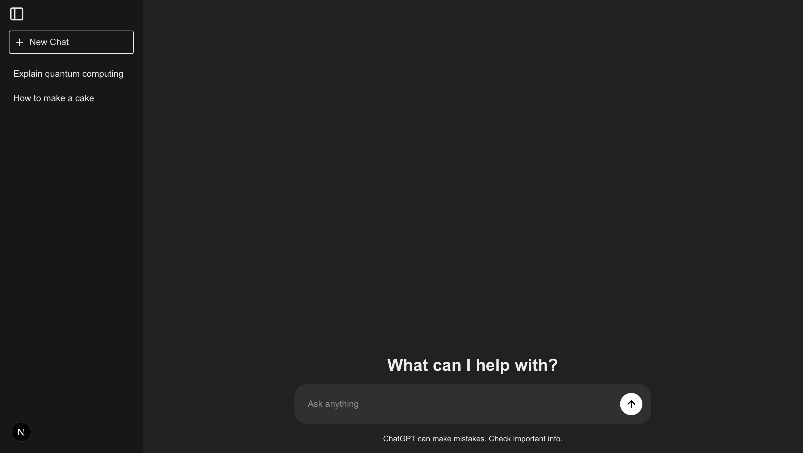

# 💬 ChatGPT-UI

A sleek and responsive user interface for interacting with OpenAI's ChatGPT API. This project provides a customizable and developer-friendly frontend to simulate ChatGPT-style conversations.

---

## 🚀 Features

- 🧠 Chat interface powered by OpenAI’s API (ChatGPT)
- ✨ Modern, responsive UI built with React (and Tailwind)
- 💾 Message history and context retention
- 🎨 Dark/light mode toggle
- 🔐 API key authentication (optional)
- 📜 Markdown and code block support
- 🧩 Easily extensible and customizable

---

## 📸 Demo



---

## 🛠️ Tech Stack

- **Frontend:** React.js
- **Styling:** Tailwind CSS
- **API:** OpenAI GPT-3.5 / GPT-4
- **State Management:** React Context

---

## 🔧 Setup Instructions

1. **Clone the repository**

   ```bash
   git clone https://github.com/your-username/chatgpt-ui.git
   cd chatgpt-ui
   ```

2. **Install dependencies**

   ```bash
   npm install
   # or
   yarn install
   ```

3. **Configure environment**

   Create a `.env` file in the root directory:

   ```
   VITE_OPENAI_API_KEY=your-api-key-here
   ```

4. **Run the development server**

   ```bash
   npm run dev
   # or
   yarn dev
   ```

5. Open your browser at `http://localhost:3000`

---

## 🧪 Testing

```bash
npm run test
```

---

## 📁 Project Structure

```
chatgpt-ui/
├── public/
├── src/
│   ├── api/
│   ├── components/
│   ├── utils/
│   ├── layout.jsx
│   └── page.jsx
├── .env
├── package.json
└── README.md
```

---

## 🧩 Future Enhancements

- Chat export (PDF/Markdown)
- Multi-session support
- Voice input/output
- Plugin system for tools and workflows

---

## 🤝 Contributing

Contributions are welcome! Please open an issue or submit a pull request.

1. Fork the repo
2. Create a new branch (`git checkout -b feature-name`)
3. Commit your changes (`git commit -am 'Add feature'`)
4. Push to the branch (`git push origin feature-name`)
5. Create a new Pull Request

---

## 📜 License

MIT License © \[Subham Mishra]
